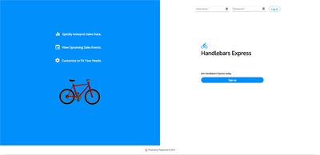
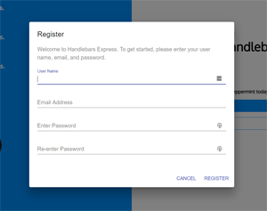
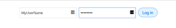
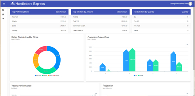

# Peppermint

### A MERN stack sales dashboard application
Use case: small Bicycle Company (Handlebars Express)
 using Peppermint sales dashboard
 to represent their company sales data

Run Application: [Launch Peppermint ](https://herokuapp.com/)

**Team Members:** Alton Salmon, Kevin Luu, Vicki Hope

**Features**
* Company Dashboard View
  * Top Stores by Sales
  * Top Items by Sales
  * Top Items by Quantity
  * Sales Distribution by Store
  * Company Sales Goals
  * Yearly Performance by Month
  * Sales Projection (next 6 months)


**Technologies Used**
* JavaScript
* MERN stack
  * MongoDB
  * Express
  * React
  * Node
* ApexCharts
* Axios
* bcrypt
* CORS
* GraphQL
* Material-UI
* Moment
* Passport-jwt
* Redux


**Problems to Solve**
* Display complex company sales data for analysis
* Secure user data and endpoints
* Securely and reliably store data, with scalability in mind
* Provide up-to-date company sales statistics
* Deploy full-stack project for others to use

**Solutions**
* Use ApexCharts to visualize sales data
* Implement passport-jwt for user/endpoint authentication
* Use MongoDB for data storage
* Use of GraphQL queries to retrieve data
* Deploy project using Heroku

**Setup to run application on your system**
* Node.js, MongoDB, and Mongoose must be installed on your system
* You will store YOUR MONGODB_URI in your local .env file
* You must know your JWT secret and store it in your local .env file
    ```
    MONGODB_URI=mongodb
    secret=yoursecretkeyhere
    ```
* Clone the Peppermint repo into a dirctory on your system
* From command line, while in that directory key:
    ```
    npm install
    ```
* From that same directory, populate the database
    ```
    node seedDB.js
    ```
* To start server, key:
    ```
    npm run start:dev
    ```
* In browser, navigate to "http://localhost:3001", you should see the Peppermint Home Login Screen

  

* Click sign up button to create a user profile

  

* Log in with user profile

  

* If login is authenticated, you should see the Dashboard - Company View

  


**Resource Contributors**
* Home page image: [Red Bicycle](https://pngtree.com/freepng/red-cartoon-bike_283117.html)

**Future Enhancement Ideas**
* Add two-factor authentication to improve security
* Support for custom views (Store, Item, etc.)
* Support for custom widgets/charts
* Support for real-time notifications


